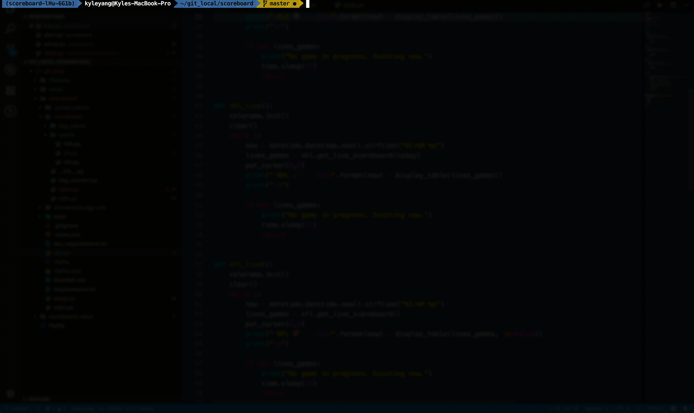

[](https://travis-ci.org/keyanyang/scoreboard)

### Sports Live in Terminal - checking real time score and highlights

## Live Scoreboard
<p align="center">

</p>

## Live Content
<p align="center">

</p>

## Requirements
Install required packages by pip
```
pip install -r requirements.txt
```

It does not yet work on Python 2, but it should work with Python 3.

## Usage
`python live.py`

or installing it first from source

`python setup.py develop`

then just use `live` in terminal

`python start.py --mlb` to check the live score and picture
